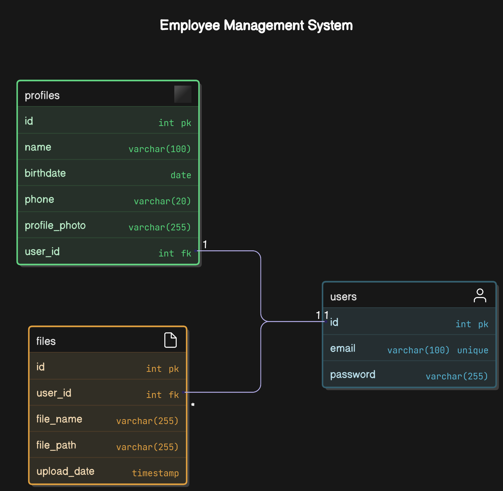

# Sistema de Gestão de Funcionários

Este é um sistema de gestão de funcionários desenvolvido em **PHP puro** com **MySQL** e **Bootstrap** para a interface. O sistema permite que os utilizadores façam login, gerem os seus perfis, façam upload de ficheiros e visualizem/eliminem ficheiros enviados.

## Funcionalidades

### Login e Autenticação

- Os utilizadores podem fazer login com e-mail e palavra-passe.
- A palavra-passe é validada e comparada com o hash armazenado na base de dados.
- Mensagens de erro específicas para e-mail não encontrado ou palavra-passe incorreta.

### Perfil do Utilizador

- Os utilizadores podem atualizar as suas informações pessoais, como nome, data de nascimento, telefone e foto de perfil.
- A foto de perfil é armazenada no sistema de ficheiros, e o caminho é guardado na base de dados.

### Upload de Ficheiros

- Os utilizadores podem fazer upload de ficheiros.
- O sistema impede o upload de ficheiros com o mesmo nome para o mesmo utilizador.
- Os ficheiros são armazenados na pasta `uploads`, e os metadados são guardados na base de dados.

### Gestão de Ficheiros

- Os utilizadores podem visualizar e eliminar ficheiros enviados.
- Cada ficheiro é exibido com o seu nome, data de upload e um botão para download/eliminação.

### Segurança

- Acesso restrito a páginas protegidas (como `profile.php` e `files.php`) apenas para utilizadores autenticados.
- Proteção contra upload de ficheiros duplicados.

## Pré-requisitos

- Servidor web (por exemplo, **XAMPP, WAMP ou Laragon**).
- **PHP 7.4 ou superior**.
- **MySQL**.
- **Navegador moderno** (Chrome, Firefox, Edge, etc.).

## Configuração

### Diagrama Entidade-Relação

<p align="center"></p>

### 1. Base de Dados

Crie uma base de dados chamada `employee_management`.

Execute o seguinte SQL para criar as tabelas necessárias:

```sql
-- Create the database
CREATE DATABASE employee_management;

-- Select the database
USE employee_management;

-- Users table
CREATE TABLE users (
    id INT AUTO_INCREMENT PRIMARY KEY,
    email VARCHAR(100) NOT NULL UNIQUE,
    password VARCHAR(255) NOT NULL
);

-- Profiles table
CREATE TABLE profiles (
    id INT AUTO_INCREMENT PRIMARY KEY,
    user_id INT NOT NULL,
    name VARCHAR(100) NOT NULL,
    birthdate DATE,
    phone VARCHAR(20),
    profile_photo VARCHAR(255), -- Path to the profile photo
    FOREIGN KEY (user_id) REFERENCES users(id) ON DELETE CASCADE
);

-- Files table
CREATE TABLE files (
    id INT AUTO_INCREMENT PRIMARY KEY,
    user_id INT NOT NULL,
    file_name VARCHAR(255) NOT NULL,
    file_path VARCHAR(255) NOT NULL, -- Path to the file on the server
    upload_date TIMESTAMP DEFAULT CURRENT_TIMESTAMP,
    FOREIGN KEY (user_id) REFERENCES users(id) ON DELETE CASCADE
);

-- Insert a test user (password: "123456" hashed)
INSERT INTO users (email, password)
VALUES (
    'ricardo.vieira@example.com',
    SHA2('123456', 256)
);

-- Insert the test user's profile
INSERT INTO profiles (user_id, name, birthdate, phone)
VALUES (
    1, -- ID do utilizador inserido acima
    'Ricardo Vieira',
    '2003-01-14',
    '912345678'
);
```

### 2. Configuração do Projeto

Clone ou faça o download do repositório do projeto.

Coloque os ficheiros na pasta do seu servidor web (por exemplo, `htdocs` no **XAMPP**).

Configure o ficheiro `connection/db.php` com as credenciais da sua base de dados:

```php
<?php
$server = 'localhost';
$database = 'employee_management';
$user = 'root';
$password = '';

$connection = new mysqli($server, $user, $password, $database);

if ($connection->connect_error) {
    die("Erro na ligação: " . $connection->connect_error);
}
?>
```

Crie a pasta `uploads` na raiz do projeto para armazenar os ficheiros enviados:

```
/employee_management/uploads
```

Certifique-se de que a pasta `uploads` tem permissões de escrita.

### 3. Executando o Projeto

1. Inicie o servidor web e o MySQL.
2. Aceda ao projeto no navegador:

```
http://localhost/employee_management
```

3. Faça login com o utilizador de teste:
   - **E-mail:** `john.doe@example.com`
   - **Palavra-passe:** `123456`

## Estrutura do Projeto

```
/employee_management
    /assets
        /css
            styles.css
    /connection
        db.php
    /controllers
        auth.php
        profile_functions.php
        files_functions.php
    /validations
        loginValidation.php
        fileValidation.php
        profileValidation
    /uploads
    index.php
    overview.php
    profile.php
    files.php
    logout.php
```

## Funcionalidades Detalhadas

### Página de Login (`index.php`)

- Os utilizadores podem fazer login com e-mail e palavra-passe.
- Validação de e-mail e palavra-passe.
- Mensagens de erro específicas para e-mail não encontrado ou palavra-passe incorreta.

### Página de Visão Geral (`overview.php`)

- Após o login, os utilizadores são redirecionados para esta página.
- Links para aceder ao perfil e aos ficheiros.

### Página de Perfil (`profile.php`)

- Os utilizadores podem atualizar as suas informações pessoais.
- Upload de foto de perfil.

### Página de Ficheiros (`files.php`)

- Os utilizadores podem fazer upload de ficheiros.
- Visualização e eliminação de ficheiros enviados.
- Impede o upload de ficheiros com o mesmo nome.

### Logout (`logout.php`)

- Encerra a sessão do utilizador e redireciona para a página de login.

## Melhorias Futuras

- Adicionar suporte para recuperação de palavra-passe.
- Implementar roles e permissões (por exemplo, **admin** vs. **utilizador comum**).
- Adicionar paginação para a lista de ficheiros.
- Melhorar a segurança com **rate limiting** e proteção contra ataques de **Brute Force**.
